---

### About

CS grad who builds things from home-lab infrastructure and automation tools to ML pipelines and computer vision systems. I care about software that's simple, practical, and actually works.

Currently exploring the intersection of systems programming and AI.

---

### Tech Stack

| Category | Tools |
|---|---|
| **Languages** | Python · C++ · Bash · SQL |
| **ML / CV** | PyTorch · OpenCV · CUDA · NumPy · Pandas · Matplotlib |
| **Backend** | FastAPI · Flask · SQLite · PostgreSQL · MySQL |
| **Infra** | Docker · Git · CMake · Gradle · PlatformIO |
| **Hardware** | Raspberry Pi · NVIDIA GPU |

---

### Stats

---

&nbsp;

